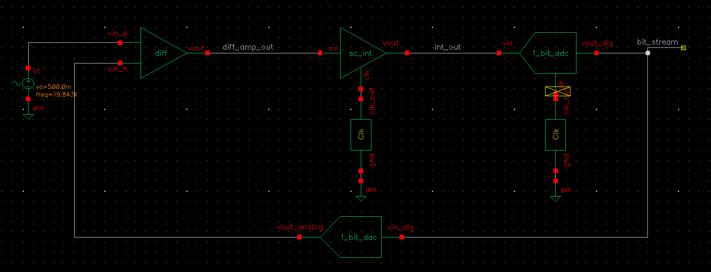
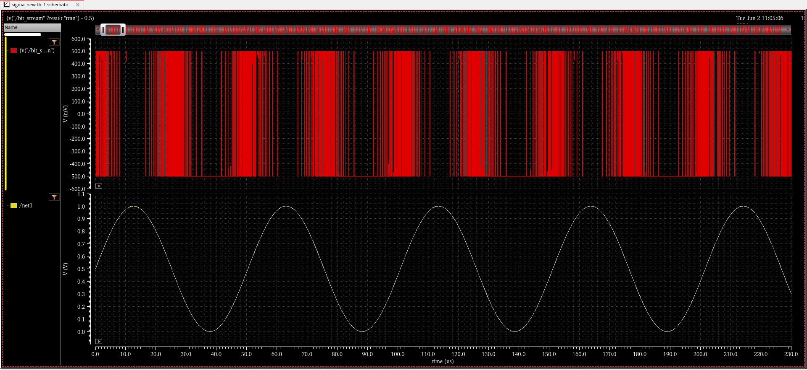
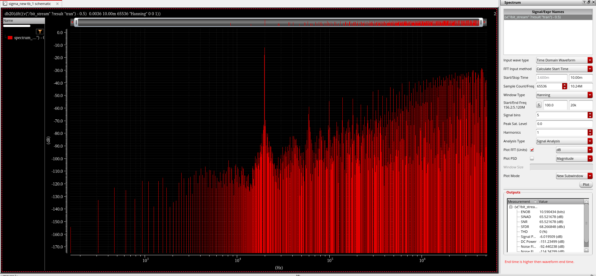

# Behavioral Modeling and Non-Ideality Analysis of a 1st-Order Sigma-Delta Modulator using Verilog-A

## Overview

This repository contains the complete behavioral design, simulation, and non-ideality analysis of a **1st-Order Sigma-Delta (ΣΔ) Modulator** implemented using **Verilog-A** in the **Cadence Virtuoso** environment.

The project investigates the operation of a discrete-time sigma-delta ADC architecture and evaluates the impact of various circuit non-idealities on dynamic performance metrics such as **SNR** and **ENOB**.

The behavioral model was first validated in MATLAB/Simulink and subsequently implemented in Cadence Virtuoso for detailed Spectre simulations.

---

## Project Objectives

* Design a complete behavioral model of a 1st-Order ΣΔ Modulator.
* Validate first-order noise shaping characteristics.
* Analyze FFT spectra and dynamic performance.
* Investigate the impact of practical circuit non-idealities:

  * Finite Op-Amp Gain
  * Thermal (kT/C) Noise
  * Comparator Offset
  * DAC Mismatch
  * Capacitor Mismatch
  * Clock Jitter

---

## System Specifications

| Parameter                | Value                           |
| ------------------------ | ------------------------------- |
| Architecture             | 1st-Order Sigma-Delta Modulator |
| Sampling Frequency (Fs)  | 10.24 MHz                       |
| Signal Bandwidth         | 20 kHz                          |
| Oversampling Ratio (OSR) | 256                             |
| Input Signal Amplitude   | 0.5 V                           |                    |
| Modeling Language        | Verilog-A                       |
| Simulation Environment   | Cadence Virtuoso / Spectre      |

---

## Repository Structure

```text
├── VerilogA/
│   ├── Difference Block
│   ├── SC_Integrator
│   ├── 1 bit ADC
│   ├── 1 bit DAC
│   └── Clock
│
├── Images/
│   ├── testbench_schematic.png
│   ├── transient_output.png
│   ├── fft_ideal.png
│
├── final_report.pdf
│   
│
└── README.md
```

---

## Behavioral Blocks Implemented

### Difference Block

Computes the error signal:

[
V_{error}=V_{in}-V_{DAC}
]

### Switched-Capacitor Integrator

Acts as the loop filter and performs discrete-time integration of the error signal.

### 1-Bit ADC (Quantizer)

Samples the integrator output and generates a single-bit digital output.

### 1-Bit DAC

Converts the quantizer output back into analog form and closes the feedback loop.

### Clock Generator

Provides the sampling clock for the modulator operation.

---

## Simulation Results

### Ideal Modulator Performance

| Metric              | Value        |
| ------------------- | ------------ |
| SNR                 | 70.14 dB     |
| ENOB                | 11.35 bits   |
| Noise-Shaping Slope | 20 dB/decade |

The ideal implementation successfully demonstrates first-order quantization noise shaping and validates the theoretical Noise Transfer Function (NTF).

## Results Gallery

### Testbench Schematic



### Transient Output



### FFT Spectrum



---

## Tools Used

* Cadence Virtuoso
* Spectre Simulator
* Verilog-A
* MATLAB / Simulink
* ViVA Spectrum Analyzer


## Authors

**Rithwik D**
Department of Electronics and Communication Engineering
National Institute of Technology Calicut

**Devesh K Bharathraj**
Department of Electronics and Communication Engineering
National Institute of Technology Calicut

---

## References

1. Schreier & Temes – *Understanding Delta-Sigma Data Converters*
2. Razavi – *Design of Analog CMOS Integrated Circuits*
3. Baker – *CMOS Circuit Design, Layout and Simulation*
4. Johns & Martin – *Analog Integrated Circuit Design*

---

## License

This repository is intended for academic and educational purposes.
